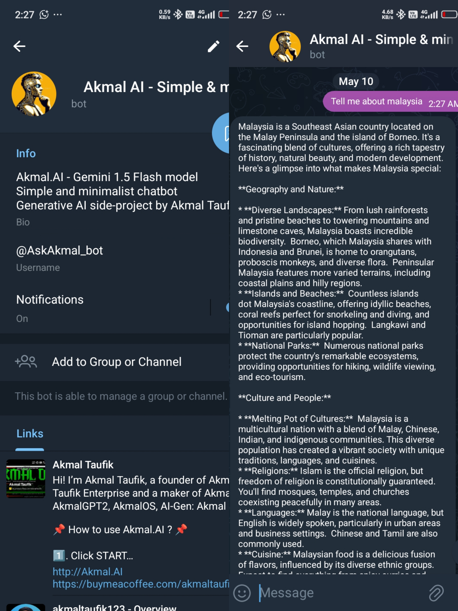
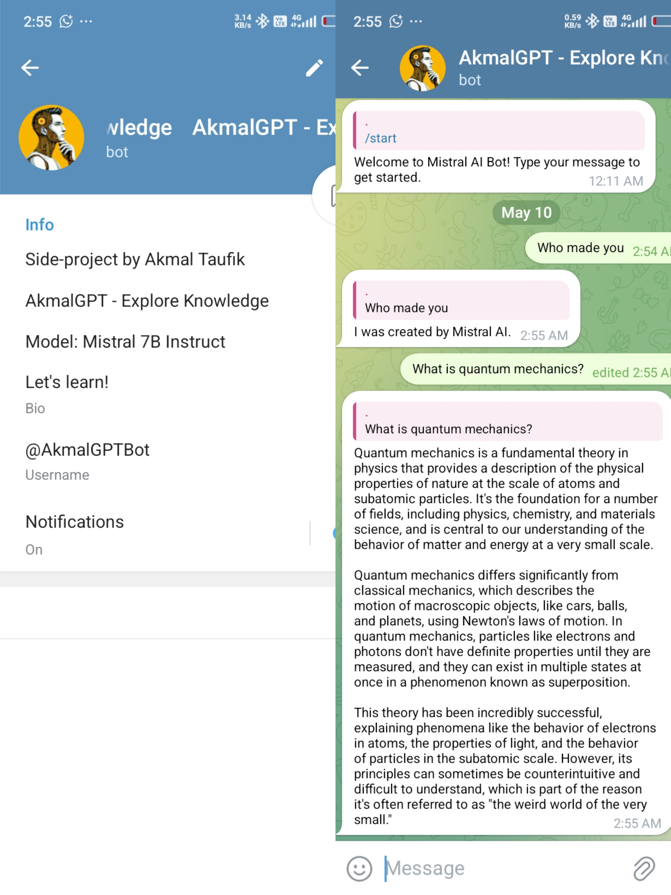
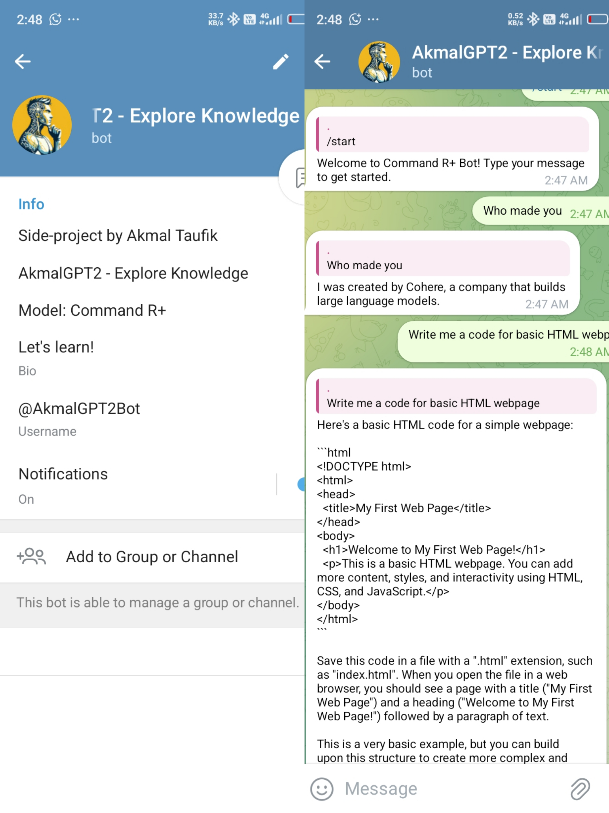
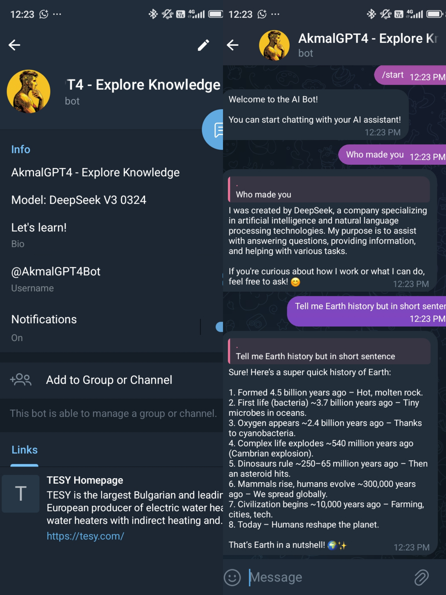
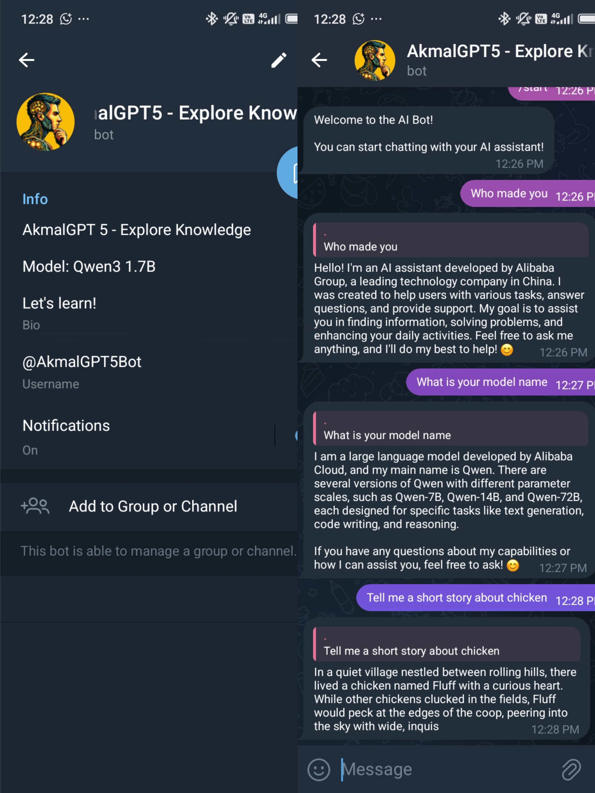
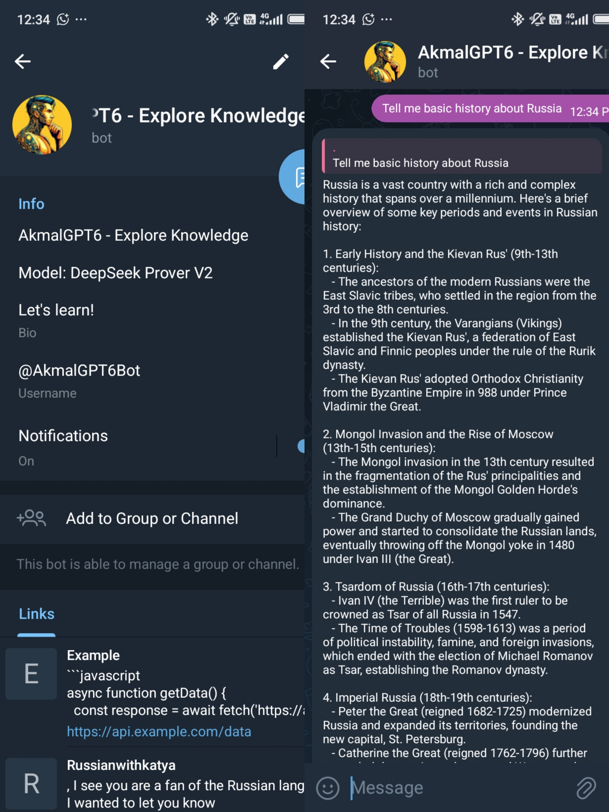

# AkmalGPT-Series
A multi-agent AI bot series built entirely on a smartphone using API-based LLMs (OpenRouter & Gemini). Runs fully on Termux and Telegram Bot, simulating practical AI integration in resource-limited environments.
# AkmalGPT-Series

AkmalGPT-Series is a seven lightweight multi-agent AI bot series developed entirely using a smartphone (POCO C75) via Termux. This project demonstrates the ability to build practical AI-powered bots using API-based LLMs without any heavy computation or model training.

---

## Table of Contents
- [Project Summary](#project-summary)
- [Architecture Overview](#architecture-overview)
- [LLMs Used](#llms-used)
- [Key Features](#key-features)
- [Screenshots](#screenshots)
- [Why This Project Matters](#why-this-project-matters)
- [Future Plans](#future-plans)

---

## Project Summary

AkmalGPT-Series consists of seven AI agents (AkmalGPT, AkmalGPT2, AkmalGPT3, AkmalGPT4, AkmalGPT5, AkmalGPT6 & Akmal AI), each experimenting with different LLMs and prompts. The entire series runs on a smartphone using Termux, simulating real-world AI integration under extreme resource constraints.

---

## Architecture Overview
- Device: POCO C75
- Environment: Termux (F-Droid version)
- Language: Python
- Deployment: Telegram Bot API
- Model Access: OpenRouter API & Gemini API

---

## LLMs Used

- OpenRouter models:
  - Gemini 1.5 Flash
  - Mistral 7B Instruct
  - Command R+
  - DeepHermes 3 24B Mistral Preview
  - DeepSeek V3 0324
  - Qwen3 1.7B
  - DeepSeek Prover V2

---

## Key Features

- Run entirely on smartphone with no actual and proper GPU
- Support for multi-agent conversations
- Modular design with fallback logic
- Built-in prompt chaining & system roles
- Real-time responses with minimal latency

---

## Screenshots

## Akmal AI: Gemini 1.5 Flash Model

## AkmalGPT: Mistral 7B Instruct Model

## AkmalGPT2: Command R+ Model

## AkmalGPT3: DeepHermes 3 24B Mistral Preview

## AkmalGPT4: DeepSeek V3 0324 Model

## AkmalGPT5: Qwen3 1.7B Model

## AkmalGPT6: DeepSeek Prover V2 Model

## Why This Project Matters

- Shows real-world use of LLM APIs on mobile devices
- Practical for developers in low-resource environments
- Great for prototyping agent systems without running your own model
- Combines engineering creativity with actual LLM understanding

---

## Future Plans

- Add lightweight AI memory per session
- Build CLI-only chatbot version (offline fallback mode)
- Build LLMs from scratch for commercial use
---

## License

MIT License (or your preferred license)

---

## Developer

Akmal Taufik
- [LinkedIn](https://www.linkedin.com/in/akmaltaufik)  
- work.akmaltaufik@gmail.com  
- [WhatsApp](https://wa.me/message/X5E7COZJHTFRK1)
