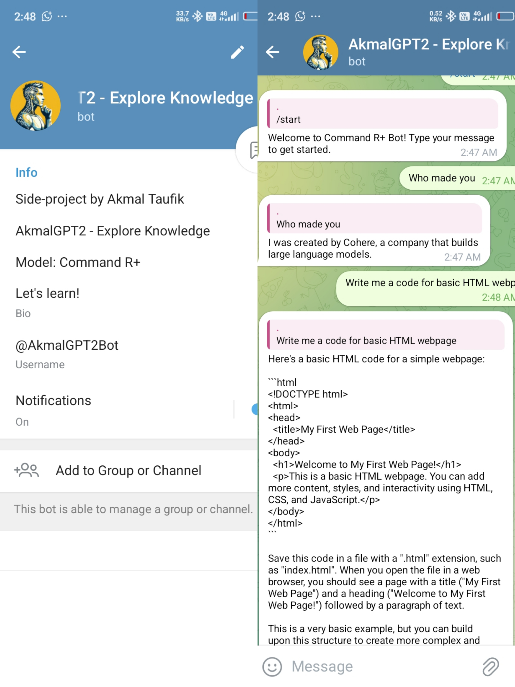
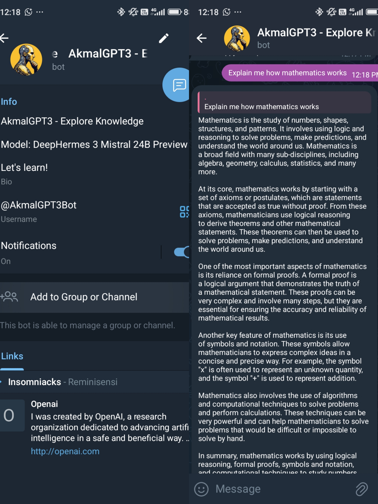

# AkmalGPT-Series
A multi-agent AI bot series built entirely on a smartphone using API-based LLMs (OpenRouter & Gemini). Runs fully on Termux and Telegram Bot, simulating practical AI integration in resource-limited environments.
# AkmalGPT-Series

AkmalGPT-Series is a seven lightweight multi-agent AI bot series developed entirely using a smartphone (POCO C75) via Termux. This project demonstrates the ability to build practical AI-powered bots using API-based LLMs without any heavy computation or model training.

---

## Table of Contents
- [Project Summary](#project-summary)
- [Architecture Overview](#architecture-overview)
- [LLMs Used](#llms-used)
- [Key Features](#key-features)
- [Screenshots](#screenshots)
- [Why This Project Matters](#why-this-project-matters)
- [Future Plans](#future-plans)

---

## Project Summary

AkmalGPT-Series consists of seven AI agents (AkmalGPT, AkmalGPT2, AkmalGPT3, AkmalGPT4, AkmalGPT5, AkmalGPT6 & Akmal AI), each experimenting with different LLMs and prompts. The entire series runs on a smartphone using Termux, simulating real-world AI integration under extreme resource constraints.

---

## Architecture Overview
- Device: POCO C75
- Environment: Termux (F-Droid version)
- Language: Python
- Deployment: Telegram Bot API
- Model Access: OpenRouter API & Gemini API

---

## LLMs Used

- OpenRouter models:
  - Gemini 1.5 Flash
  - Mistral 7B Instruct
  - Command R+
  - DeepHermes 3 24B Mistral Preview
  - DeepSeek V3 0324
  - Qwen3 1.7B
  - DeepSeek Prover V2

---

## Key Features

- Run entirely on smartphone with no actual and proper GPU
- Support for multi-agent conversations
- Modular design with fallback logic
- Built-in prompt chaining & system roles
- Real-time responses with minimal latency

---

## Screenshots

## Akmal AI: Gemini 1.5 Flash Model

**Gemini 1.5 Flash Integration**

**This project supports integration with Gemini 1.5 Flash, Google's latest multimodal AI model. Gemini 1.5 Flash is designed for high-speed, lightweight performance while maintaining impressive capabilities across:**
- Text comprehension and generation
- Code understanding
- Document parsing
- Multimodal reasoning (text, image, audio, etc.)
- Real-time interaction

**In the AkmalGPT-Series, Gemini 1.5 Flash can be used as an alternative to OpenAI's GPT models for:**
- Fast AI chatbot responses
- Lightweight document and image analysis
- Enhanced user interaction in Telegram bots

**Why Gemini 1.5 Flash?:**
- Faster response times
- Lower latency, lower compute cost
- Ideal for real-time use cases in Termux and mobile-based bots
- Supports streaming output for smooth user experience

**Note:** To use Gemini 1.5 Flash in your own deployment, you must have access to the Google AI Studio or Gemini API, and provide your API key securely.

## AkmalGPT: Mistral 7B Instruct Model

**Mistral 7B Instruct Integration**

**This project supports integration with Mistral 7B Instruct, an open-weight instruction-tuned large language model developed by Mistral AI. Mistral 7B Instruct is designed for efficient performance and high-quality responses while maintaining a compact, resource-friendly architecture.:**
- Text comprehension and generation
- Instruction following and conversational tasks
- Code explanation and completion
- Document analysis and summarization
- Offline and self-hosted deployment capabilities

**In the AkmalGPT-Series, Mistral 7B Instruct can be used as an alternative to proprietary models like GPT or Gemini for:**
- AI chatbot responses with open-source flexibility
- Offline or self-hosted bot setups
- Local document and code processing
- Customizable and privacy-friendly user experiences

**Why Mistral 7B Instruct?:**
- Open-source and freely available
- No API keys or usage limits required
- Ideal for local deployment, Termux setups, and edge devices
- Compatible with multiple inference backends (Ollama, Llama.cpp, etc.)

**Note:** To use Mistral 7B Instruct in your own deployment, you can access this model via OpenRouter, which provides a seamless platform for deploying and interacting with large language models. Simply integrate it into your Telegram bot through the OpenRouter API and configure your bot to connect to the local or hosted endpoint. This eliminates the need for setting up a separate inference backend like Ollama, Text Generation WebUI, Llama.cpp, or vLLM.

## AkmalGPT2: Command R+ Model

**Command R+ Integration**

**This project supports integration with Command R+, an advanced language model optimized for fast response generation and intelligent task execution. Command R+ is designed for efficient performance, offering high-quality answers and real-time conversational capabilities, making it ideal for interactive applications like Telegram bots.:**
- Text comprehension and generation
- Command-based interaction and task automation
- Real-time query resolution
- Intelligent conversational agents
- Optimized for lightweight environments

**In the AkmalGPT-Series, Command R+ can be used as an alternative to proprietary models like GPT or Gemini for:**
- AI chatbot responses with intelligent task handling in Telegram bots
- Command-based Telegram bot interactions for specific actions or queries
- Real-time query processing in Telegram bots for fast user interaction
- Customizable and task-oriented Telegram bot experiences

**Why Command R+?:**
- Optimized for fast, real-time responses
- Ideal for task automation and command-based interactions
- No heavy compute requirements, perfect for Telegram bots in mobile or resource-constrained environments
- Open and flexible, customizable to meet various bot use cases

**Note:** To use Command R+ in your own deployment, you can access this model via OpenRouter, which provides an easy-to-use platform for deploying and interacting with large language models. Simply integrate it into your Telegram bot through the OpenRouter API and ensure it can efficiently process commands and queries in real-time. The model can be deployed using lightweight frameworks for both local and cloud-based setups.

## AkmalGPT3: DeepHermes 3 24B Mistral Preview

**DeepHermes 3 24B Mistral Preview Integration**

**This project supports integration with DeepHermes 3 24B Mistral Preview, an advanced large language model developed by DeepHermes AI. The 24 billion parameter version of DeepHermes 3 is optimized for high-performance language understanding, generation, and reasoning tasks, providing superior capabilities for conversational AI and complex queries.:**
- Text comprehension and generation
- Advanced reasoning and logic tasks
- Code interpretation and generation
- Contextual understanding and conversation flow
- Multimodal support (text, code, and images)

**In the AkmalGPT-Series, DeepHermes 3 24B Mistral Preview can be used as a powerful alternative to proprietary models like GPT, Gemini, or Mistral 7B for:**
- High-quality AI chatbot responses in Telegram bots
- Advanced document and code analysis for specific tasks and user queries
- Context-aware conversation management in interactive Telegram bot experiences
- Sophisticated multimodal interactions in Telegram bots for enhanced user engagement

**Why DeepHermes 3 24B Mistral Preview?:**
- 24 billion parameters for cutting-edge language understanding
- Ideal for complex tasks, reasoning, and generating high-quality responses
- Supports multimodal input, allowing for richer interactions (e.g., combining text and images)
- No API fees or rate limits, enabling full control over deployment
- Efficient deployment on local or cloud servers, making it suitable for high-traffic Telegram bots

**Note:**
To use DeepHermes 3 24B Mistral Preview in your deployment, you can access this model through OpenRouter, which provides an easy-to-use platform for deploying and interacting with large language models. Simply integrate it into your Telegram bot via the OpenRouter API, and ensure that you have sufficient compute resources for optimal performance, especially for complex and multimodal tasks.

## AkmalGPT4: DeepSeek V3 0324 Model

**DeepSeek V3 0324 Integration**

**This project supports integration with DeepSeek V3 0324, a powerful and efficient large language model developed by DeepSeek AI. This version is optimized for multilingual understanding, code tasks, and general-purpose reasoning, making it a versatile choice for AI-based applications like chatbots, assistants, and code tools.:**
- Natural language understanding and generation
- Multilingual support
- Code generation and explanation
- Instruction-following and Q&A
- Context-aware conversation handling

**In the AkmalGPT-Series, DeepSeek V3 0324 can be used as an effective alternative to proprietary models for:**
- Smart and fluent chatbot responses in Telegram bots
- Multilingual document analysis and summarization
- Coding help, explanation, and completion tasks
- Custom AI assistant features with real-time interaction

**Why DeepSeek V3 0324?:**
- Strong performance on reasoning and logic tasks
- Multilingual and code-aware
- Open-weight model with no usage restrictions
- Supports both cloud and local deployment
- Lightweight enough for Termux-based and mobile setups

**Note:**
To use DeepSeek V3 0324 in your own deployment, you can access it via OpenRouter, which offers an easy-to-integrate API for real-time AI interactions. Simply connect it to your Telegram bot backend, and you're ready to deploy high-quality AI features without the need for complex infrastructure.

## AkmalGPT5: Qwen3 1.7B Model

**Qwen3 1.7B Integration**

**This project supports integration with Qwen3 1.7B, a lightweight, instruction-tuned open-source model developed by Alibaba Cloud's Qwen team. Despite its compact size, Qwen3 1.7B delivers impressive performance on everyday natural language and code tasks, making it ideal for mobile, Termux, and edge-device deployments.:**
- Natural language understanding and generation
- Instruction following and conversation
- Code generation and basic reasoning
- Low-latency, resource-efficient performance

**In the AkmalGPT-Series, Qwen3 1.7B is a great fit for:**
- Fast, lightweight AI chatbot functionality in Telegram bots
- Offline or mobile-based deployments using Termux
- Basic code support and multilingual Q&A
- Privacy-focused local processing without heavy compute

**Why Qwen3 1.7B?:**
- Ultra lightweight (1.7B parameters) for fast response
- Open-source and fully free to use
- No API key or billing required
- Perfect for low-resource environments and mobile AI bots
- Great for learning, prototyping, or deploying lightweight AI

**Note:**

You can easily deploy Qwen3 1.7B using OpenRouter, which provides a convenient way to access the model via API. This allows seamless integration into your Telegram bot without requiring manual backend setup.
⁷
## AkmalGPT6: DeepSeek Prover V2 Model

**DeepSeek Prover V2 Integration**

**This project supports integration with DeepSeek Prover V2, a cutting-edge language model developed by DeepSeek AI, specifically optimized for mathematical reasoning, logical proofs, and code-based problem-solving. It excels in tasks requiring multi-step thought, symbolic manipulation, and formal reasoning.:**
- Advanced math problem solving
- Theorem proving and logic-based tasks
- Code generation and verification
- Chain-of-thought reasoning
- Multi-turn contextual understanding

**In the AkmalGPT-Series, DeepSeek Prover V2 is ideal for:**
- AI chatbot features involving logic, math, and structured answers in Telegram bots
- Educational use cases such as tutoring or math Q&A
- Code generation and verification for structured or algorithmic tasks
- Advanced reasoning assistance in mobile or Termux setups

**Why DeepSeek Prover V2?:**
- Specialized for math, logic, and structured reasoning
- Excellent for STEM-focused bot features
- Open model suitable for both local and cloud use
- Can handle complex multi-step reasoning tasks
- Efficient and accessible even on modest setups

**Note:**
You can use DeepSeek Prover V2 via OpenRouter, which provides easy API access for integration into your Telegram bot backend.

## Why This Project Matters

- Shows real-world use of LLM APIs on mobile devices
- Practical for developers in low-resource environments
- Great for prototyping agent systems without running your own model
- Combines engineering creativity with actual LLM understanding

## Future Plans

- Add lightweight AI memory per session
- Build CLI-only chatbot version (offline fallback mode)
- Build LLMs from scratch for commercial use

## License

MIT License

Copyright (c) 2025 Akmal Taufik

Permission is hereby granted, free of charge, to any person obtaining a copy
of this software and associated documentation files (the "Software"), to deal
in the Software without restriction, including without limitation the rights  
to use, copy, modify, merge, publish, distribute, sublicense, and/or sell      
copies of the Software, and to permit persons to whom the Software is         
furnished to do so, subject to the following conditions:                       

The above copyright notice and this permission notice shall be included in    
all copies or substantial portions of the Software.                            

THE SOFTWARE IS PROVIDED "AS IS", WITHOUT WARRANTY OF ANY KIND, EXPRESS OR    
IMPLIED, INCLUDING BUT NOT LIMITED TO THE WARRANTIES OF MERCHANTABILITY,      
FITNESS FOR A PARTICULAR PURPOSE AND NONINFRINGEMENT. IN NO EVENT SHALL THE   
AUTHORS OR COPYRIGHT HOLDERS BE LIABLE FOR ANY CLAIM, DAMAGES OR OTHER        
LIABILITY, WHETHER IN AN ACTION OF CONTRACT, TORT OR OTHERWISE, ARISING FROM, 
OUT OF OR IN CONNECTION WITH THE SOFTWARE OR THE USE OR OTHER DEALINGS IN     
THE SOFTWARE.

---

## Developer

Akmal Taufik
- [LinkedIn](https://www.linkedin.com/in/akmaltaufik)  
- work.akmaltaufik@gmail.com  
- [WhatsApp](https://wa.me/message/X5E7COZJHTFRK1)
